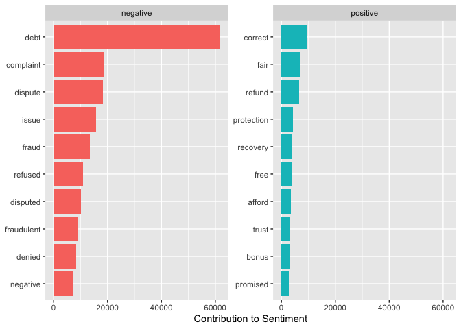
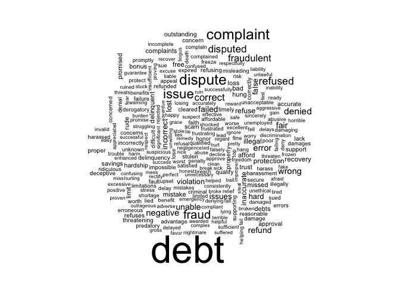

Sentiment Analysis
================
Houssam Hallouch

## Introduction

Sentiment analysis is a powerful tool for businesses to understand how
customers perceive their products or services. With the advent of social
media and online reviews, sentiment analysis has become increasingly
important in analyzing consumer behavior and predicting market trends.
In this project, I will be performing sentiment analysis on consumer
complaints related to financial products, using a dataset obtained from
Kaggle.


## Dictionary

The dataset includes 18 variables and 670598 observations. Among those
product and consumer complaint narrative will be used to analyze the
sentiment of each complaint.

## Data Cleaning

1.  Initially, selected the relevant two variables from the dataset and
    created a new dataset.

    ``` r
    complaint<-complaint %>% select(Product,Consumer.complaint.narrative)
    ```

2.  Next, sentences are broken into words so that we can check the
    sentiments of each of those words.

    ``` r
    complaint.word <- complaint %>%
      group_by(Product) %>%
      mutate(linenumber = row_number())%>%
      ungroup() %>%
      unnest_tokens(word, Consumer.complaint.narrative)
    ```

3.  Next, stop words are removed from those words so that we can ignore
    the irrelevant words.

    ``` r
    complaint.word<-complaint.word %>% anti_join(stop_words)
    ```

        ## Joining, by = "word"

4.  Next, I have created positive and negative sentiments values for
    each of those products. After, grouped the dataset to get total
    sentiments for identifying lowest Products (highest negative
    values).

    ``` r
    textdata::lexicon_nrc()
    ```

        ## # A tibble: 13,872 × 2
        ##    word        sentiment
        ##    <chr>       <chr>    
        ##  1 abacus      trust    
        ##  2 abandon     fear     
        ##  3 abandon     negative 
        ##  4 abandon     sadness  
        ##  5 abandoned   anger    
        ##  6 abandoned   fear     
        ##  7 abandoned   negative 
        ##  8 abandoned   sadness  
        ##  9 abandonment anger    
        ## 10 abandonment fear     
        ## # … with 13,862 more rows
        ## # ℹ Use `print(n = ...)` to see more rows

    ``` r
        nrc_joy<-get_sentiments("nrc") %>%
      filter(sentiment == "joy")


        clean_Data <- complaint.word %>%
      inner_join(get_sentiments("bing")) %>%
      count(Product, index = linenumber %/% 80, sentiment) %>%
      pivot_wider(names_from = sentiment, values_from = n, values_fill = 0) %>% 
      mutate(sentiment = positive - negative)
    ```

        ## Joining, by = "word"

    ``` r
        df <- clean_Data %>% group_by(Product) %>% 
      summarise(sum_sentiment=sum(sentiment),
                .groups = 'drop') %>%
      as.data.frame()
    ```

5.  Taken top 5 Products with lowest sentiment for visualisations.

    ``` r
    df2<-df[order(df$sum_sentiment, decreasing = F),]
    top_5<-df2[1:5,]
    unique(top_5$Product)
    ```

        ## [1] "Debt collection"         "Mortgage"               
        ## [3] "Credit reporting"        "Credit card"            
        ## [5] "Bank account or service"

## Top 5 Products with Lowest Sentiments (highest negative values)

``` r
    top_5 %>% 
      mutate(Product=factor(Product,levels= unique(top_5$Product),ordered = T)) %>% 
    ggplot(aes(Product,sum_sentiment))+
      geom_bar(stat="identity",aes(fill=Product))+
      labs( title = "Top 5 Products with Lowest Sentiments",x="Product", y="Sentiment Value")+
scale_x_discrete(labels = function(x) str_wrap(x, width = 20))
```

<!-- -->

Based on the chart above, we can observe that the most negative
sentiments are reported in customer complaints regarding **Debt
Collection** products, followed by **Mortgage** products. **Credit
Reporting** products have the third most negative sentiments reported in
customer complaints.

## Words having the most positive and negative sentiments among the complaints

Among complaints there are different positive and negative words. Using
*bing* lexicon, separated the words into positive and negative one.
Also, taken count of those words by their sentiments.

``` r
bing_counts <- complaint.word %>%
  inner_join(get_sentiments("bing")) %>%
  count(word, sentiment, sort = TRUE) %>%
  ungroup()
```

    ## Joining, by = "word"

Next, I have created the chart for checking top positive and negative
words side by side.

``` r
bing_counts %>%
  group_by(sentiment) %>%
  slice_max(n, n = 10) %>% 
  ungroup() %>%
  mutate(word = reorder(word, n)) %>%
  ggplot(aes(n, word, fill = sentiment)) +
  geom_col(show.legend = FALSE) +
  facet_wrap(~sentiment, scales = "free_y") +
  labs(x = "Contribution to Sentiment",
       y = NULL)
```

<!-- -->

Based on the above bar charts, it is apparent that there are fewer
positive words in the complaints compared to negative words. The most
commonly used positive word is **correct**, followed by **fair**. On the
other hand, the most frequently used negative word is **debt**, followed
by **complaint**.

## Word Cloud of the complaints’ words

``` r
set.seed(2023)
bing_wordcloud<-bing_counts %>%
  select(word,n)
  wordcloud(words = bing_wordcloud$word,freq = bing_wordcloud$n,min.freq = 500)
```

<!-- -->

By examining the above word cloud, we can determine the most frequently
used words in the complaints based on their size. It is evident that the
word **debt** is the most common, followed by **complaint** and then
**dispute**. Therefore, we can conclude that these three words are used
most frequently in the complaints.

## Conclusion

In conclusion, sentiment analysis is a valuable tool for businesses to
gain insight into customer perceptions of their products or services.
The analysis of consumer complaints related to financial products in
this project reveals that Debt Collection products and Mortgage products
are associated with the most negative sentiments. Furthermore, it is
apparent that there are fewer positive words in the complaints compared
to negative words, with “correct” and “fair” being the most commonly
used positive words and “debt” and “complaint” being the most frequently
used negative words. Additionally, the word cloud analysis highlights
that “debt”, “complaint”, and “dispute” are the most frequently used
words in the complaints. Overall, this analysis provides valuable
information for businesses to identify areas for improvement and better
meet the needs of their customers.
